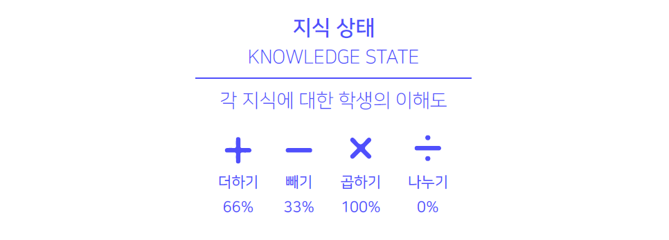
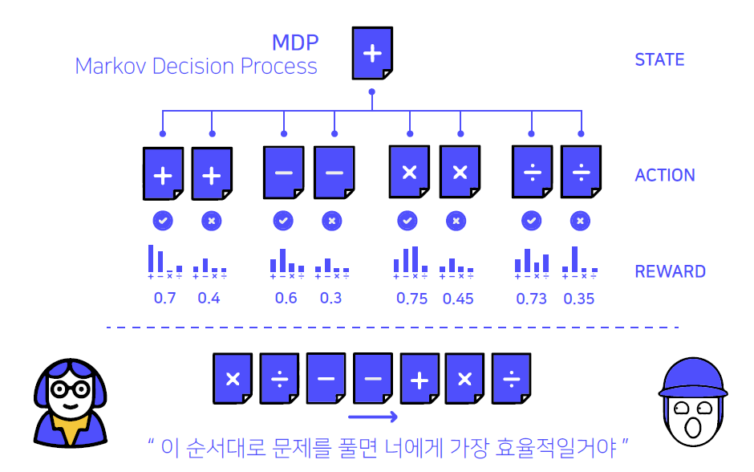

# 📖 Stage 4 - DKT (Deep Knowledge Tracing) ✏️

> More explanations of our codes are in 🔎[TEAM-IKYO's WIKI](https://github.com/bcaitech1/p4-dkt-team-ikyo/wiki)

<p align="center">
  
</p>

## 🧑‍🤝‍🧑 Members


| [권태양](https://github.com/sunnight9507) | [류재희](https://github.com/JaeheeRyu) | [박종헌](https://github.com/PJHgh) | [오수지](https://github.com/ohsuz) | [이현규](https://github.com/LeeHyeonKyu) | [정익효](https://github.com/dlrgy22) |
| :-: | :-: | :-: | :-: | :-: | :-: |
|  |  |  |  |  |  |
| [Notion](https://www.notion.so/Sunny-1349e293c9f74de092dce9ee359bd77c) | [Notion](https://www.notion.so/AI-Research-Engineer-6f6537a7675542be901a3499e71140f9) | [Notion](https://www.notion.so/Boostcamp-deef2c0783f24c0b8022ba30b5782986) | [Notion](https://www.ohsuz.dev/) | [Notion](https://www.notion.so/thinkwisely/Naver-Boost-Camp-AI-Tech-ba743126e68749d58bdbb7af0580c8ee) |   |
| ENFJ | ISTP | INTJ | ENTP | ESTJ | INFP |

---

## 💻 Task Description

> More Description can be found at [AI Stages](http://boostcamp.stages.ai/competitions/42/overview/description)

초등학교, 중학교, 고등학교, 대학교와 같은 교육기관에서 우리는 시험을 늘 봐왔습니다. 시험 성적이 높은 과목은 우리가 잘 아는 것을 나타내고 시험 성적이 낮은 과목은 반대로 공부가 더욱 필요함을 나타냅니다. 시험은 우리가 얼마만큼 아는지 평가하는 한 방법입니다.

하지만 시험에는 한계가 있습니다. 우리가 수학 시험에서 점수를 80점 받았다면 우리는 80점을 받은 학생일 뿐입니다. 우리가 돈을 들여 과외를 받지 않는 이상 우리는 우리 개개인에 맞춤화된 피드백을 받기가 어렵고 따라서 무엇을 해야 성적을 올릴 수 있을지 판단하기 어렵습니다. 이럴 때 사용할 수 있는 것이 DKT입니다!

DKT는 Deep Knowledge Tracing의 약자로 우리의 "지식 상태"를 추적하는 딥러닝 방법론입니다.



시험을 보는 것은 동일하지만 단순히 우리가 수학을 80점을 맞았다고 알려주는 것을 넘어서 우리가 수학이라는 과목을 얼마만큼 이해하고 있는지를 측정하여 줍니다. 게다가 이런 이해도를 활용하여 우리가 아직 풀지 않은 미래의 문제에 대해서 우리가 맞을지 틀릴지 예측이 가능합니다!


이런 DKT를 활용하면 우리는 학생 개개인에게 수학의 이해도와 취약한 부분을 극복하기 위해 어떤 문제들을 풀면 좋을지 추천이 가능합니다! 그렇기 때문에 DKT는 교육 AI의 추천이라고도 불립니다. DKT는 맞춤화된 교육을 제공하기 위해 아주 중요한 역할을 맡게 됩니다.



우리는 대회에서 Iscream 데이터셋을 이용하여 DKT모델을 구축할 것입니다. 다만 대회에서는 학생 개개인의 이해도를 가리키는 지식 상태를 예측하는 일보다는, 주어진 문제를 맞출지 틀릴지 예측하는 것에 집중할 것입니다! 우리는 각 학생이 푼 문제 리스트와 정답 여부가 담긴 데이터를 받아 최종 문제를 맞출지 틀릴지 예측할 것입니다!


개인 맞춤화 교육이라는 멋진 미래를 만들기 위한 DKT로 함께 떠나봅시다!

---

## 🗂 Directory

```
p4-dkt-team-ikyo
├── code
│   ├── EDA
│   │   └── TeamIkyo_EDA.ipynb
│   ├── Feature Engineering
│   │   └── feature_engineering.py
│   ├── LGBM
│   │   ├── lgbm_baseline.ipynb
│   │   └── lgbm_function.py
│   ├── Deep Learning
│   │   ├── .py
│   │   └── .py
│   ├── Ensemble
│   │   ├── power_ensemble.ipynb
│   │   └── stacking.ipynb
│   └── script
│       ├── DL_train.sh
│       ├── DL_inference.sh
│       ├── ML_train.sh
│       └── ML_inference.sh
└── requirements.txt
```
